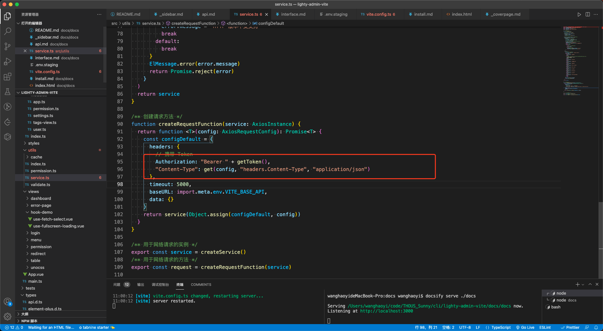

# 概述

以登录为例叙述完整数据处理流程。包括配置 api 接口、在页面上调用接口发起请求、Pinia 保存用户信息、经过路由守卫的拦截，成功跳转到首页、Token 鉴权，判断是否退出登录。

# 配置登录接口

## 目录结构

`src/api` 目录下找到 `login` 文件夹.这个文件夹即代表了登录模块
**（注意是登录模块，不止是登录接口。如果该模块下还有子模块的话，你可以继续往下面再建立子模块的文件夹）**
login 文件夹里面再建立一个 types 文件夹（这个文件夹专门放置和登录模块相关的 TS 类型）和 index.ts。

## 编写 TS 类型

编写接口的 TS 类型，必须提前拿到接口的请求参数和响应数据的格式，请提前要求后端同事提供接口文档。
这个项目本身的登录接口的类型定义如下：

### 请求数据类型 ILoginRequestData

```ts
export interface ILoginRequestData {
  /** admin 或 editor */
  username: "admin" | "editor"
  /** 密码 */
  password: string
  /** 验证码 */
  code: string
}
```

### 响应数据类型

```ts
export type LoginResponseData = IApiResponseData<{ token: string }>
```

将类型 `{ token: string } `作为泛型传递给类型 `IApiResponseData` ，IApiResponseData 这个类型作为一个全局类型，被定义在` @/types/api.d.ts` 文件里：

```ts
/** 所有 api 接口的响应数据都应该准守该格式 */
interface IApiResponseData<T> {
  code: number
  data: T
  message: string
}
```

最终响应数据类型 `LoginResponseData` 就相当于：

```ts
{
  code: number
  data: {
    token: string
  }
  message: string
}
```

## 编写接口

发送请求是通过封装好的 Axios，所以第一步就是导入相关的方法

```ts
import { request } from "@/utils/service"
```

还需要上文写好的登录接口的类型，将其导入进来

```ts
import type * as Login from "./types/login"
```

接口内容

```ts
/** 登录并返回 Token */
export function loginApi(data: Login.ILoginRequestData) {
  return request<Login.LoginResponseData>({
    url: "users/login",
    method: "post",
    data
  })
}
```

这表示登录接口的函数名为 `loginApi`，它接受一个参数 `data`，类型为 `ILoginRequestData`。

`request<Login.LoginResponseData>` 则表示的是待会接口响应成功的数据类型为 `LoginResponseData`.

url 代表接口地址，method 代表接口方法（get/post/put/delete），data 表示请求体数据（如果是 get 请求，则要换成 params）

其他格式数据需要添加`transformRequest`属性来进行`qs`格式化

# 调用登录接口

## 点击登录按钮

```ts
const handleLogin = () => {
  loginFormRef.value?.validate((valid: boolean) => {
    if (valid) {
      loading.value = true
      useUserStore()
        .login({
          username: loginForm.username,
          password: loginForm.password,
          code: loginForm.code
        })
        .then(() => {
          router.push({ path: "/" })
        })
        .catch(() => {
          createCode()
          loginForm.password = ""
        })
        .finally(() => {
          loading.value = false
        })
    } else {
      return false
    }
  })
}
```

`loginFormRef.value?.validate` 是校验登录表单，

`useUserStore()` 是写好的 状态管理器 `Pinia` 的 `Store`
调用该 `Store` 的 `login action`，并传入用户名、密码、验证码三个参数即可。

`login action` 返回值是一个 Promise，所以我们后面链式跟一个 .then 、 .catch 和 .finally，接口调用成功则会执行 .then （跳转到首页），如果途中发生错误，则会执行 .catch，而无论什么情况都会执行 .finally

可以直接在登录页调用登录接口的（而不是将登录接口放到状态管理逻辑里面去），等拿到接口返回的数据之后，再调用状态管理器保存用户登录状态，然后再跳转页面也可以

## 状态管理

在 `useUserStore` 里，我们引入了上文写好的登录接口 `loginApi：`

```ts
import { loginApi, getUserInfoApi } from "@/api/login"
```

然后在 `login action` 中调用这个 `loginApi` 并传入对应参数（如果这里参数传递错误，那么 TS 就会报错提醒我们，因为我们在上文中定义接口的时候已经约束了类型）

调用登录接口成功时，我们将接口返回的响应数据 res 中的 token 分别保存到 cookie（对应语句 setToken(res.data.token)）和 当前 Store（对应语句 token.value = res.data.token） 中，如果接口失败，则直接 reject 即可

## 路由守卫

`src\router\permission.ts`
概述路由守卫内业务逻辑，具体代码参照注释

    1、判断用户是否登录，没登录则只能进入白名单页面，比如登录页
    2、如果已经登录，那么将不允许进入登录页
    3、如果已经登录，那么还要检查是否拿到用户角色，如果没有，并且开启了动态路由功能，则要调用用户详情接口
    4、如果没有开启动态路由功能，则启用默认角色
    5、不管什么情况，一旦发生错误，就重置 Token，并重定向到登录页

```ts
import router from "@/router"
import { useUserStoreHook } from "@/store/modules/user"
import { usePermissionStoreHook } from "@/store/modules/permission"
import { ElMessage } from "element-plus"
import { whiteList } from "@/config/white-list"
import { getToken } from "@/utils/cache/cookies"
import asyncRouteSettings from "@/config/async-route"
import NProgress from "nprogress"
import "nprogress/nprogress.css"

NProgress.configure({ showSpinner: false })

router.beforeEach(async (to, _from, next) => {
  NProgress.start()
  const userStore = useUserStoreHook()
  const permissionStore = usePermissionStoreHook()
  // 判断该用户是否登录
  if (getToken()) {
    if (to.path === "/login") {
      // 如果已经登录，并准备进入 Login 页面，则重定向到主页
      next({ path: "/" })
      NProgress.done()
    } else {
      // 检查用户是否已获得其权限角色
      if (userStore.roles.length === 0) {
        try {
          if (asyncRouteSettings.open) {
            // 注意：角色必须是一个数组！ 例如: ['admin'] 或 ['developer', 'editor']
            await userStore.getInfo()
            const roles = userStore.roles
            // 根据角色生成可访问的 Routes（可访问路由 = 常驻路由 + 有访问权限的动态路由）
            permissionStore.setRoutes(roles)
          } else {
            // 没有开启动态路由功能，则启用默认角色
            userStore.setRoles(asyncRouteSettings.defaultRoles)
            permissionStore.setRoutes(asyncRouteSettings.defaultRoles)
          }
          // 将'有访问权限的动态路由' 添加到 Router 中
          permissionStore.dynamicRoutes.forEach((route) => {
            router.addRoute(route)
          })
          // 确保添加路由已完成
          // 设置 replace: true, 因此导航将不会留下历史记录
          next({ ...to, replace: true })
        } catch (err: any) {
          // 过程中发生任何错误，都直接重置 Token，并重定向到登录页面
          userStore.resetToken()
          ElMessage.error(err.message || "路由守卫过程发生错误")
          next("/login")
          NProgress.done()
        }
      } else {
        next()
      }
    }
  } else {
    // 如果没有 Token
    if (whiteList.indexOf(to.path) !== -1) {
      // 如果在免登录的白名单中，则直接进入
      next()
    } else {
      // 其他没有访问权限的页面将被重定向到登录页面
      next("/login")
      NProgress.done()
    }
  }
})

router.afterEach(() => {
  NProgress.done()
})
```

# 鉴权

后续所有的操作，将携带保存在前端的 `token` 去调用接口，token 将是后端服务判断当前请求合不合法的依据。

`token` 已经过期后，理论上接口会给我们抛出一个 http code 401 的错误，我们只需要在响应拦截器里重定向到登录页即可
