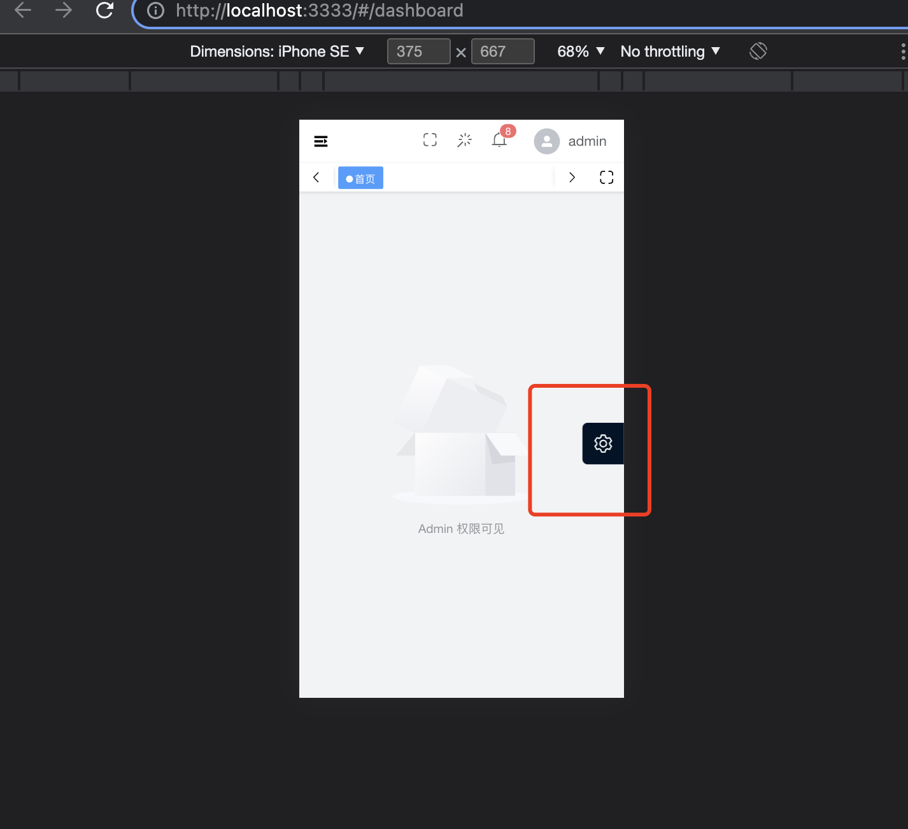

# 概述

如何使用平台内的配置，包括和布局相关的隐藏标签栏、和路由相关的路由缓存、和样式相关的修改全局颜色

# 布局配置

页面右侧默认有全局样式设置按钮 如图

这个按钮固定于页面，关闭这个设置不需要修改源码，src/config/layout.ts 布局配置文件中将 showSettings 配置项修改为 false 即可
其中按钮展开后每个选项的配置项都可以在 src/config/layout.ts 配置文件中对应关闭

# 路由菜单

路由的定义以及配置在 src/router/index.ts 中
为了让编辑器对这些配置项有类型提示，平台还对路由属性进行了 TS 定义，放在了` @/types/vue-router.d.ts` 文件下，如果你需要改造或者新增配置项，那你也应该同步修改这个文件
ts 类型定义如下

```ts
/**
 * 设置该路由在侧边栏和面包屑中展示的名字
 */
title?: string
/**
 * 设置该路由的图标，记得将 svg 导入 @/icons/svg
 */
svgIcon?: string
/**
 * 设置该路由的图标，直接使用 Element Plus 的 Icon（与 svgIcon 同时设置时，svgIcon 将优先生效）
 */
elIcon?: string
/**
 * 默认 false，设置 true 的时候该路由不会在侧边栏出现
 */
hidden?: boolean
/**
 * 设置该路由进入的权限，支持多个权限叠加
 */
roles?: string[]
/**
 * 默认 true，如果设置为 false，则不会在面包屑中显示
 */
breadcrumb?: boolean
/**
 * 默认 false，如果设置为 true，它则会固定在 tags-view 中
 */
affix?: boolean
/**
 * 当一个路由下面的 children 声明的路由大于 1 个时，自动会变成嵌套的模式，
 * 只有一个时，会将那个子路由当做根路由显示在侧边栏，
 * 若想不管路由下面的 children 声明的个数都显示你的根路由，
 * 可以设置 alwaysShow: true，这样就会忽略之前定义的规则，一直显示根路由
 */
alwaysShow?: boolean
/**
 * 示例: activeMenu: "/xxx/xxx"，
 * 当设置了该属性进入路由时，则会高亮 activeMenu 属性对应的侧边栏。
 * 该属性适合使用在有 hidden: true 属性的路由上
 */
activeMenu?: string
/**
 * 是否缓存该路由页面
 * 默认为 false，为 true 时代表需要缓存，此时该路由和该页面都需要设置一致的 Name
 */
keepAlive?: boolean

```

## 设置图标

以首页为例，若不设置图标，则 svgIcon 和 elIcon 则为空

```ts
meta: {
  title: "首页",
  affix: true
}

```

### 设置 element plus 的图标

在 elementplus 的官网找到符合要求的图标代码后 例如 icon 为 house 的，可以直接使用 elIcon 配置项使用它

```ts
meta: {
  title: "首页",
  elIcon: "House",
  affix: true
}

```

### 设置 svg

假如想使用本地的 SVG 图标，那你应该将静态资源复制到 @/icons/svg 目录下
直接用 svgIcon 配置项使用它：

```ts
meta: {
  title: "首页",
  svgIcon: "dashboard",
  affix: true
}

```

## 设置缓存

设置路由缓存需要同时满足四个条件

      1、路由keepAlive为true
      2、路由有Name
      3、页面有Name
      4、路由与页面Name保持一致

以表格路由为例

```ts
{
path: "/table",
component: Layout,
redirect: "/table/element-plus",
name: "Table",
meta: {
  title: "表格",
  elIcon: "Grid"
},
children: [
  {
    path: "element-plus",
    component: () => import("@/views/table/element-plus/index.vue"),
    name: "ElementPlus",
    meta: {
      title: "Element Plus",
      keepAlive: true
    }
  },
  {
    path: "vxe-table",
    component: () => import("@/views/table/vxe-table/index.vue"),
    name: "VxeTable",
    meta: {
      title: "Vxe Table",
      keepAlive: true
    }
  }
]
}

```

可以看见两个路由的 Name 分别是 ElementPlus 和 VxeTable，我们还需要去对应的页面上配置相同的 Name：

```ts
defineOptions({
  name: "ElementPlus"
})
```

```ts
defineOptions({ name: "vxeTable" })
```

## 面包屑

面包屑 `@/layout/components/BreadCrumb `也是根据路由动态生成的，为路由设置 `breadcrumb: false `时该路由将不会出现在面包屑中，设置 `redirect: 'noRedirect'` 时该路由在面包屑中不能被点击

# 全局样式

全局样式相关的的文件，全都在` @/styles` 目录下
`vxe-table.scss`：这里可以写样式来覆盖 vxe-table 原本的样式
`element-plus.scss`：这里可以写样式来覆盖 element-plus 原本的样式
`transition.scss`： 这里可以写动画相关的样式
`mixins.scss`：这里可以写和 scss mixin 相关的样式
`variables.css`：这里是本项目内置的一些比较重要的和布局、颜色相关的全局样式
`index.scss`：这里是所有样式的入口，也可以写样式来覆盖原生 html 的样式
`theme`： 这里是多主题模式相关的样式文件，目前内置了黑暗模式、深蓝色模式
多主题模式的 `theme` 目录后续会单独出一篇文章，这里就不展开了，
简单演示一下修改 `variables.css `的效果：

```css
/** 全局 CSS 变量，这种变量不仅可以在 CSS 和 SCSS 中使用，还可以导入到 JS 中使用 */

:root {
  /** 全局背景色 */
  --v3-body-bg-color: #f2f3f5;
  /** Header 区域 = NavigationBar 组件 + TagsView 组件 */
  --v3-header-height: calc(var(--v3-navigationbar-height) + var(--v3-tagsview-height));
  /** NavigationBar 组件 */
  --v3-navigationbar-height: 50px;
  /** Sidebar 组件 */
  --v3-sidebar-width: 220px;
  --v3-sidebar-hide-width: 58px;
  --v3-sidebar-menu-item-height: 60px;
  --v3-sidebar-menu-tip-line-bg-color: var(--el-color-primary);
  --v3-sidebar-menu-bg-color: #001428;
  --v3-sidebar-menu-hover-bg-color: #ffffff10;
  --v3-sidebar-menu-text-color: #c0c4cc;
  --v3-sidebar-menu-active-text-color: #ffffff;
  /** SidebarLogo 组件 */
  --v3-sidebarlogo-bg-color: #001428;
  /** TagsView 组件 */
  --v3-tagsview-height: 34px;
  --v3-tagsview-tag-text-color: #495060;
  --v3-tagsview-tag-active-text-color: #ffffff;
  --v3-tagsview-tag-bg-color: #ffffff;
  --v3-tagsview-tag-active-bg-color: var(--el-color-primary);
  --v3-tagsview-tag-border-radius: 2px;
  --v3-tagsview-tag-border-color: #d8dce5;
  --v3-tagsview-tag-active-border-color: var(--el-color-primary);
  --v3-tagsview-tag-active-before-color: #ffffff;
  --v3-tagsview-tag-icon-hover-bg-color: #00000030;
  --v3-tagsview-tag-icon-hover-color: #ffffff;
  /** RightPanel 组件  */
  --v3-rightpanel-button-bg-color: #001428;
}
```

将上面的全局背景色灰白色 --v3-body-bg-color: #f2f3f5 改成黑色 #000000
