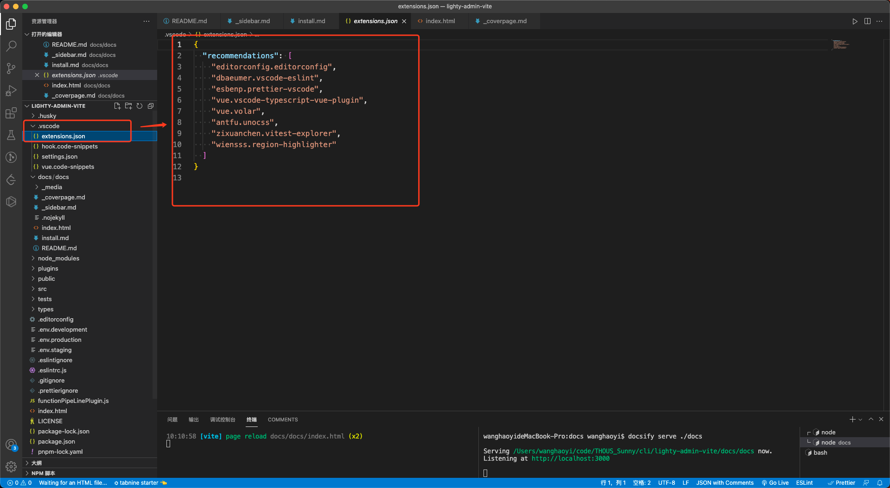
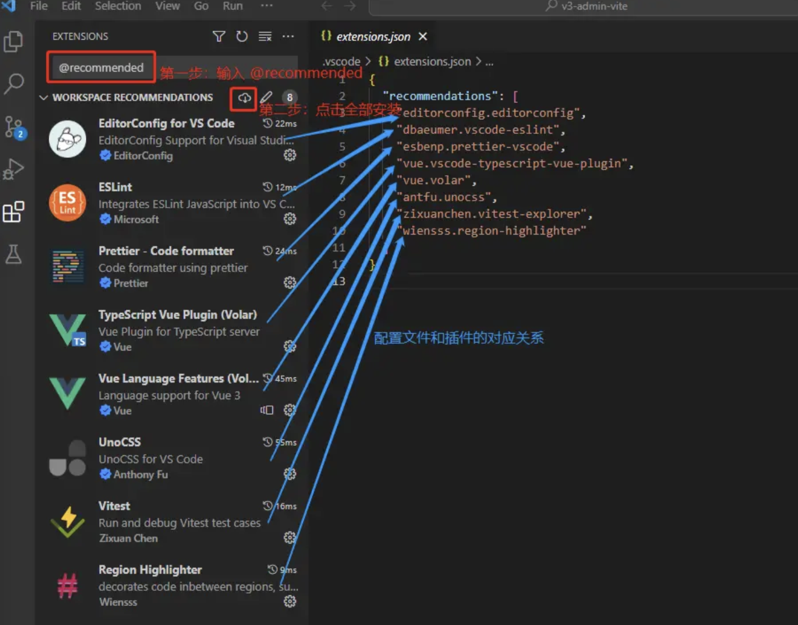

# node

去 node 官网下载并安装 node 环境：nodejs.org/zh-cn/ ，一般选择最新的 LTS （长期维护）版本即可（编写本文时本地使用 16.14.1 版本）。建议使用 nvm 灵活管理 node 版本。

`建议版本：node 版本不低于 16 即可`

# pnpm

由于 lighty Admin Vite 是推荐使用 pnpm 命令来安装第三方依赖，而不是直接使用 npm 命令。所以这边要提前将 pnpm 安装好。官网安装方法：
[pnpm.io/zh/installa…](https://pnpm.io/zh/installation "https://pnpm.io/zh/installation")
可直接通过 npm 命令安装

```sh
npm install -g pnpm
```

安装后同样也是使用 -v 命令来查看版本

`建议版本：7+`

# IDE

[Visual Studio Code](https://code.visualstudio.com/Download "https://code.visualstudio.com/Download")

[WebStorm](https://www.jetbrains.com/webstorm/ "https://www.jetbrains.com/webstorm/")

`建议版本：最新版`

# 运行项目

## 安装推荐插件

项目根目录下有一个 .vscode 文件夹，它是专属这个项目的 vscode 配置。其中 extensions.json 文件是用来配置本项目推荐的插件：



一件安装按图操作即可



`注意：Vue3 项目对应的是 Volar 插件，记得禁用 Vue2 的 Vetur 插件！`

## 安装依赖

依次点击 vscode 顶部的 Terminal（终端）、New Terminal（新建终端），在底部弹出的命令行窗口中输入命令：

```sh
pnpm i

```

安装慢，可以选择将官方依赖源切换为淘宝依赖源：

```sh
npm config set registry https://registry.npmmirror.com
```

切换源或者依赖失败之后，如果你要选择重新安装依赖，你需要将之前已经安装的 node_modules 文件夹和 pnpm-lock.yaml 文件删除了，再次运行安装 pnpm i 命令

## 运行

```dev
pnpm dev

```
