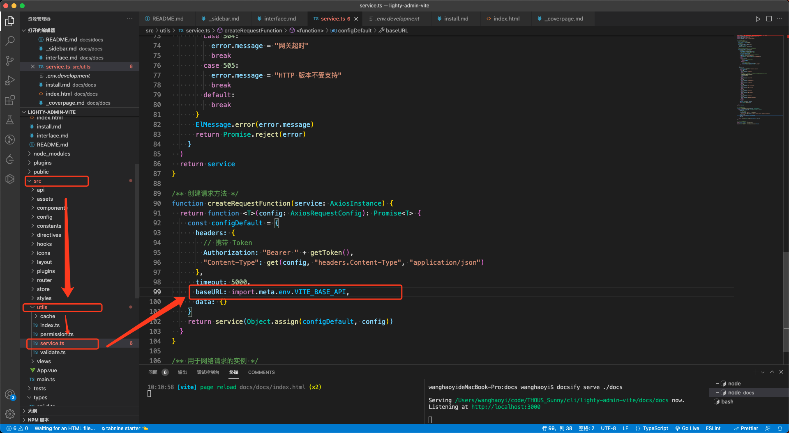
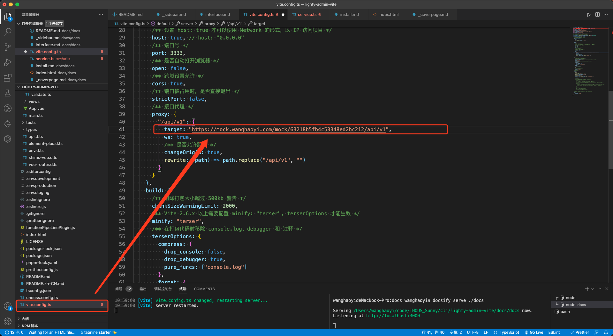

# 概述

本节讲述如何修改对接自己的后端接口、处理接口跨域、正确打包部署前端静态文件

# 设置后端接口

拦截器文件位于 src/utils/services,看见后端接口的 `baseURL` 是 `import.meta.env.VITE_BASE_API`

然后我们可以在 `.env` 配置文件中找到定义 `VITE_BASE_API` 的地方：
_**注意， `.env.development` 代表开发环境配置， `.env.staging` 代表预发布环境配置，`.env.production` 代表正式环境配置。**_

可以看见，开发环境配置中，前端配置后端接口时采用了相对路径，使用的是 `/api/v1`。假如前端本地运行在 `http://localhost:3333` 路径下，也就意味着前端调用后端接口时，调用的具体的 baseURL 将会是 `http://localhost:3333/api/v1`

# 反向代理

登录接口举例完整 url 是：
<span class="math math-inline"><span class="katex"><span class="katex-mathml"><math xmlns="http://www.w3.org/1998/Math/MathML"><semantics><mrow><mstyle mathcolor="red"></mstyle></mrow><annotation encoding="application/x-tex">\color{red}{http://localhost:3333/}</annotation></semantics></math></span><span class="katex-html" aria-hidden="true"><span class="base"><span class="strut" style="height:1em;vertical-align:-0.25em;"></span><span class="mord" style="color:red;"><span class="mord mathnormal" style="color:red;">h</span><span class="mord mathnormal" style="color:red;">ttp</span><span class="mspace" style="color:red;margin-right:0.2778em;"></span><span class="mrel" style="color:red;">:</span><span class="mspace" style="color:red;margin-right:0.2778em;"></span><span class="mord" style="color:red;">//</span><span class="mord mathnormal" style="margin-right:0.01968em;color:red;">l</span><span class="mord mathnormal" style="color:red;">oc</span><span class="mord mathnormal" style="color:red;">a</span><span class="mord mathnormal" style="margin-right:0.01968em;color:red;">l</span><span class="mord mathnormal" style="color:red;">h</span><span class="mord mathnormal" style="color:red;">os</span><span class="mord mathnormal" style="color:red;">t</span><span class="mspace" style="color:red;margin-right:0.2778em;"></span><span class="mrel" style="color:red;">:</span><span class="mspace" style="color:red;margin-right:0.2778em;"></span><span class="mord" style="color:red;">3333/</span></span></span></span></span></span> <span class="math math-inline"><span class="katex"><span class="katex-mathml"><math xmlns="http://www.w3.org/1998/Math/MathML"><semantics><mrow><mstyle mathcolor="blue"><mrow><mi>a</mi><mi>p</mi><mi>i</mi><mi mathvariant="normal">/</mi><mi>v</mi><mn>1</mn><mi mathvariant="normal">/</mi></mrow></mstyle></mrow><annotation encoding="application/x-tex">\color{blue}{api/v1/}</annotation></semantics></math></span><span class="katex-html" aria-hidden="true"><span class="base"><span class="strut" style="height:1em;vertical-align:-0.25em;"></span><span class="mord" style="color:blue;"><span class="mord mathnormal" style="color:blue;">a</span><span class="mord mathnormal" style="color:blue;">p</span><span class="mord mathnormal" style="color:blue;">i</span><span class="mord" style="color:blue;">/</span><span class="mord mathnormal" style="margin-right:0.03588em;color:blue;">v</span><span class="mord" style="color:blue;">1/</span></span></span></span></span></span> <span class="math math-inline"><span class="katex"><span class="katex-mathml"><math xmlns="http://www.w3.org/1998/Math/MathML"><semantics><mrow><mstyle mathcolor="green"><mrow><mi>u</mi><mi>s</mi><mi>e</mi><mi>r</mi><mi>s</mi><mi mathvariant="normal">/</mi><mi>l</mi><mi>o</mi><mi>g</mi><mi>i</mi><mi>n</mi></mrow></mstyle></mrow><annotation encoding="application/x-tex">\color{green}{users/login}</annotation></semantics></math></span><span class="katex-html" aria-hidden="true"><span class="base"><span class="strut" style="height:1em;vertical-align:-0.25em;"></span><span class="mord" style="color:green;"><span class="mord mathnormal" style="color:green;">u</span><span class="mord mathnormal" style="color:green;">sers</span><span class="mord" style="color:green;">/</span><span class="mord mathnormal" style="margin-right:0.01968em;color:green;">l</span><span class="mord mathnormal" style="color:green;">o</span><span class="mord mathnormal" style="margin-right:0.03588em;color:green;">g</span><span class="mord mathnormal" style="color:green;">in</span></span></span></span></span></span>

但这个路径是一个本地路径，而我们的真实后端接口是部署的线上的，假如线上部署的登录接口完整路径是：

<span class="math math-inline"><span class="katex"><span class="katex-mathml"><math xmlns="http://www.w3.org/1998/Math/MathML"><semantics><mrow><mstyle mathcolor="red"></mstyle></mrow><annotation encoding="application/x-tex">\color{red}{https://mock.wanghaoyi.com/mock/63218b5fb4c53348ed2bc212/}</annotation></semantics></math></span><span class="katex-html" aria-hidden="true"><span class="base"><span class="strut" style="height:1em;vertical-align:-0.25em;"></span><span class="mord" style="color:red;"><span class="mord mathnormal" style="color:red;">h</span><span class="mord mathnormal" style="color:red;">ttp</span><span class="mord mathnormal" style="color:red;">s</span><span class="mspace" style="color:red;margin-right:0.2778em;"></span><span class="mrel" style="color:red;">:</span><span class="mspace" style="color:red;margin-right:0.2778em;"></span><span class="mord" style="color:red;">//</span><span class="mord mathnormal" style="color:red;">m</span><span class="mord mathnormal" style="color:red;">oc</span><span class="mord mathnormal" style="margin-right:0.03148em;color:red;">k</span><span class="mord" style="color:red;">.</span><span class="mord mathnormal" style="color:red;">m</span><span class="mord mathnormal" style="color:red;">e</span><span class="mord mathnormal" style="color:red;">n</span><span class="mord mathnormal" style="color:red;">gxu</span><span class="mord mathnormal" style="color:red;">e</span><span class="mord mathnormal" style="color:red;">gu</span><span class="mord" style="color:red;">.</span><span class="mord mathnormal" style="color:red;">co</span><span class="mord mathnormal" style="color:red;">m</span><span class="mord" style="color:red;">/</span><span class="mord mathnormal" style="color:red;">m</span><span class="mord mathnormal" style="color:red;">oc</span><span class="mord mathnormal" style="margin-right:0.03148em;color:red;">k</span><span class="mord" style="color:red;">/63218</span><span class="mord mathnormal" style="color:red;">b</span><span class="mord" style="color:red;">5</span><span class="mord mathnormal" style="margin-right:0.10764em;color:red;">f</span><span class="mord mathnormal" style="color:red;">b</span><span class="mord" style="color:red;">4</span><span class="mord mathnormal" style="color:red;">c</span><span class="mord" style="color:red;">53348</span><span class="mord mathnormal" style="color:red;">e</span><span class="mord mathnormal" style="color:red;">d</span><span class="mord" style="color:red;">2</span><span class="mord mathnormal" style="color:red;">b</span><span class="mord mathnormal" style="color:red;">c</span><span class="mord" style="color:red;">212/</span></span></span></span></span></span> <span class="math math-inline"><span class="katex"><span class="katex-mathml"><math xmlns="http://www.w3.org/1998/Math/MathML"><semantics><mrow><mstyle mathcolor="blue"><mrow><mi>a</mi><mi>p</mi><mi>i</mi><mi mathvariant="normal">/</mi><mi>v</mi><mn>1</mn><mi mathvariant="normal">/</mi></mrow></mstyle></mrow><annotation encoding="application/x-tex">\color{blue}{api/v1/}</annotation></semantics></math></span><span class="katex-html" aria-hidden="true"><span class="base"><span class="strut" style="height:1em;vertical-align:-0.25em;"></span><span class="mord" style="color:blue;"><span class="mord mathnormal" style="color:blue;">a</span><span class="mord mathnormal" style="color:blue;">p</span><span class="mord mathnormal" style="color:blue;">i</span><span class="mord" style="color:blue;">/</span><span class="mord mathnormal" style="margin-right:0.03588em;color:blue;">v</span><span class="mord" style="color:blue;">1/</span></span></span></span></span></span> <span class="math math-inline"><span class="katex"><span class="katex-mathml"><math xmlns="http://www.w3.org/1998/Math/MathML"><semantics><mrow><mstyle mathcolor="green"><mrow><mi>u</mi><mi>s</mi><mi>e</mi><mi>r</mi><mi>s</mi><mi mathvariant="normal">/</mi><mi>l</mi><mi>o</mi><mi>g</mi><mi>i</mi><mi>n</mi></mrow></mstyle></mrow><annotation encoding="application/x-tex">\color{green}{users/login}</annotation></semantics></math></span><span class="katex-html" aria-hidden="true"><span class="base"><span class="strut" style="height:1em;vertical-align:-0.25em;"></span><span class="mord" style="color:green;"><span class="mord mathnormal" style="color:green;">u</span><span class="mord mathnormal" style="color:green;">sers</span><span class="mord" style="color:green;">/</span><span class="mord mathnormal" style="margin-right:0.01968em;color:green;">l</span><span class="mord mathnormal" style="color:green;">o</span><span class="mord mathnormal" style="margin-right:0.03588em;color:green;">g</span><span class="mord mathnormal" style="color:green;">in</span></span></span></span></span></span>

那么我们可以通过反向代理来将 http://localhost:3333 代理到 https://mock.wanghaoyi.com/mock/63218b5fb4c53348ed2bc212

反向代理配置如图：


这段配置代表的意思简单来说就是去匹配 `/api/v1` 这个路径，假如发送的请求包含了这个路径，那么就将进行反向代理，将请求代理到 `target` 字段配置的路径。

_**直接采用这种反向代理的好处就是前端调用后端接口时不会产生跨域问题，但要记得这只是开发环境配置好了反向代理，以后部署前端到线上环境的时候，需要采用 Nginx 或其他工具来实现线上环境的反向代理。**_

# CORS

如果你并不想用反向代理的方式来调用接口并解决跨域问题，那你就应该将你的 VITE_BASE_API 配置填写为完整的绝对路径：

```md
## 后端接口公共路径（如果解决跨域问题采用 CORS 就需要写全路径）

VITE_BASE_API = 'https://mock.mengxuegu.com/mock/63218b5fb4c53348ed2bc212/api/v1'
```

# 打包

## 选择路由模式

模板本身默认是 hash 模式，如果你想切换为 html5 模式的话，更改 VITE_ROUTER_HISTORY 配置即可：

```md
## 路由模式 hash 或 html5

VITE_ROUTER_HISTORY = 'hash'
```

_**但要注意，使用 html5 模式的话，就必须得在部署前端的服务器上新增一些配置 查看[HTML5 模式](https://router.vuejs.org/zh/guide/essentials/history-mode.html#html5-%E6%A8%A1%E5%BC%8F "https://router.vuejs.org/zh/guide/essentials/history-mode.html#html5-%E6%A8%A1%E5%BC%8F")**_

## 打包路径

最后再设置一下打包路径 VITE_PUBLIC_PATH 即可。模板项目本身是需要部署到这个域名下：`https://un-pany.github.io/lighty-admin-vite/`，所以需要这么填写：

```md
VITE_PUBLIC_PATH = '/lighty-admin-vite/'
```

依此类推，
假如是要部署到 `https://xxx.com/yyy/` 下，那么就需要填写 `VITE_PUBLIC_PATH = '/yyy/'`
假如是要部署到` https://xxx.com/` 下，那么就需要填写 `VITE_PUBLIC_PATH = '/'`

## 运行命令

参照使用场景运行命令
和打包相关的命令是 build，我们以打包正式环境为例，就要运行下面的命令：

```sh
pnpm build:prod

```

这个命令就会自动去读取我们前文配置好的 `.env.production` 文件，
而 `pnpm build:stage` 会自动读取 `.env.staging` 文件，代表的是预发布环境。
生成 `dist` 静态资源文件夹，即可。
